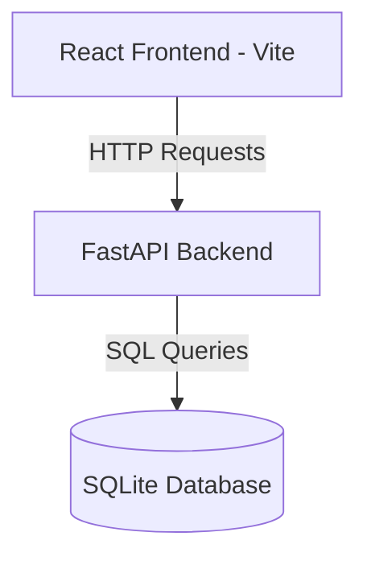
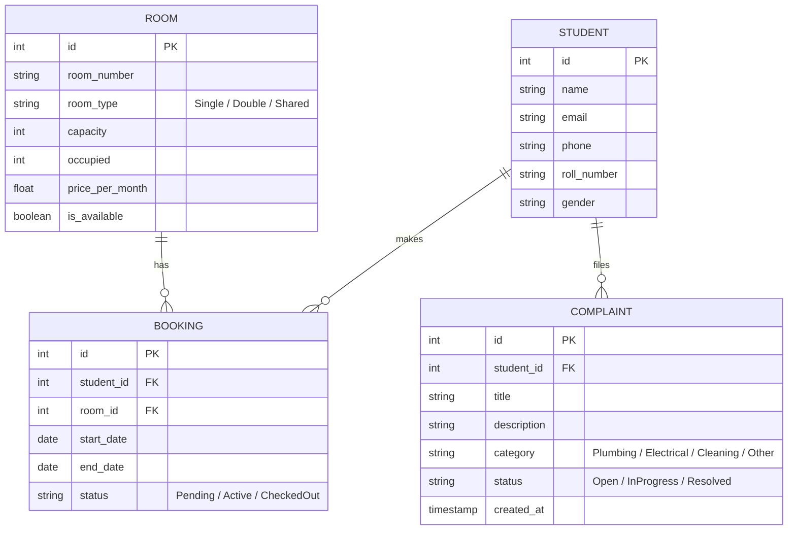

# Hostel Management System (HMS) - Build Guide

This document outlines the architecture, database schema, API design, and step-by-step implementation instructions to build the **Hostel Management System**.

---

## 🏗️ System Architecture & Tech Stack

The application is structured as a fullstack web application:



### 💻 Frontend
- **Framework**: React 19 (Vite)
- **Styling**: Vanilla CSS with modern custom properties (CSS variables) for modularity, custom themes (glassmorphism), and responsiveness.
- **State Management & Routing**: React Context / Hooks and Standard React Router (or simple conditional page routing).

### ⚙️ Backend
- **Framework**: FastAPI (Python 3.10+)
- **Database**: SQLite (built-in, serverless, relational database)
- **ORM**: SQLAlchemy (SQLAlchemy ORM) or SQLModel

---

## 🗄️ Database Schema Design

We need 4 primary tables to manage rooms, students, bookings, and complaints:



---

## 🛠️ Step-by-Step Build Plan

### Phase 1: Backend Setup
1. **Virtual Environment**: Create and activate a Python virtual environment.
2. **Dependencies**: Install core backend libraries:
   ```bash
   pip install fastapi uvicorn sqlalchemy pydantic
   ```
3. **Database Engine**: Implement `backend/database.py` to initialize SQLAlchemy and the SQLite file.
4. **Models & Schemas**: Define `backend/models.py` (SQLAlchemy models) and `backend/schemas.py` (Pydantic validation schemas).
5. **API Router Setup**: Create REST endpoints in `backend/main.py`:
   - `/api/students` (CRUD)
   - `/api/rooms` (CRUD & availability checks)
   - `/api/bookings` (Create room assignment & release)
   - `/api/complaints` (File complaint & update status)

### Phase 2: Frontend Setup & Styling
1. **Modern CSS Foundation**: Design a comprehensive CSS design system in `frontend/src/index.css` featuring:
   - Modern color palettes (deep slate, vibrant blues, accent teal).
   - Glassmorphic card styling (`backdrop-filter: blur()`).
   - Smooth custom animations for loading, hovering, and transitions.
2. **Routing & Context**: Set up page state (Dashboard, Rooms, Students, Complaints) and an API client utility using `fetch`.
3. **Components**:
   - **Dashboard**: High-level metrics (occupancy rate, pending complaints, active students).
   - **Rooms View**: Visual grid displaying available rooms, capacities, and booking status.
   - **Students View**: List of registered students with search functionality.
   - **Complaints Panel**: Helpdesk style ticket tracker for student requests.

---

## 🚀 How to Run the Project

### 1. Running the Backend
From the root directory:
```bash
# Set up requirements
pip install -r requirements.txt

# Run FastAPI server
uvicorn backend.main:app --reload
```
The interactive documentation will be available at `http://127.0.0.1:8000/docs`.

### 2. Running the Frontend
From the `frontend` directory:
```bash
npm install
npm run dev
```
The React development server will start at `http://localhost:5173`.
